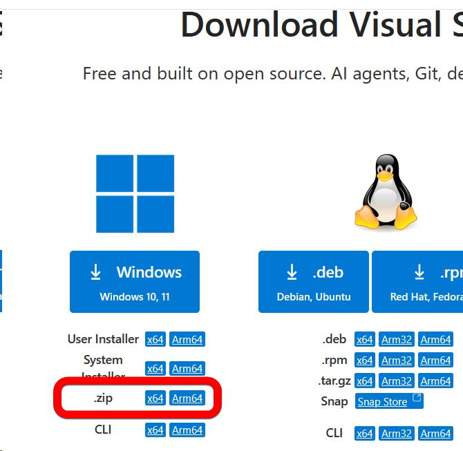
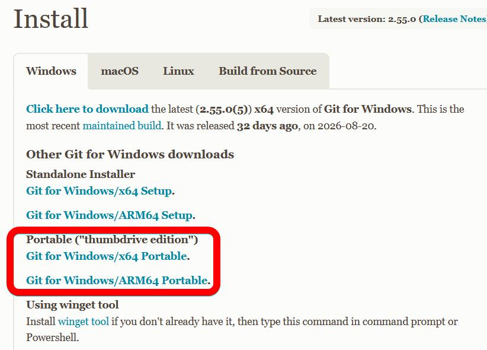
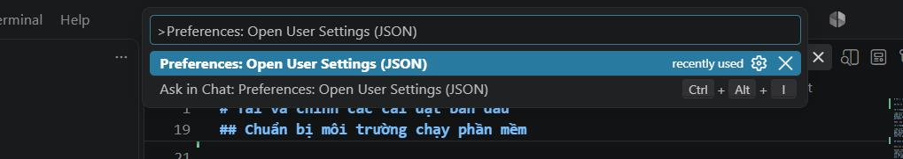
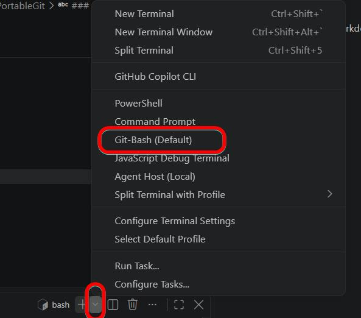
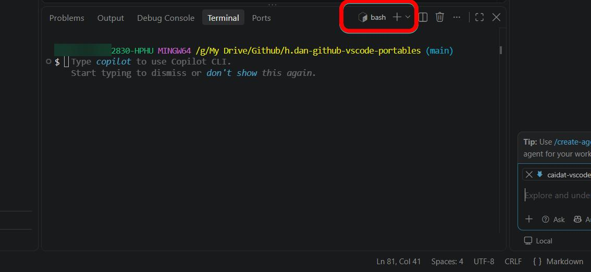

# Tải và cài đặt ban đầu cho VScode và Git


## Tải về


[Vào trang này để tải VScode](https://code.visualstudio.com/Download)



Chọn .zip là bản chạy sẵn ▲

[Vào trang tải git](https://git-scm.com/install/windows)


Chọn tải git portable


## Chuẩn bị môi trường chạy phần mềm


Giải nén cả 2 phần mềm lưu ở vị trí mong muốn

VScode trước khi chạy phải tạo thư mục data trong thư mục chương trình
" alt="thư mục chương trình Visual Studio Code, trong đó thư mục data được khoanh đỏ giữa các thư mục 7debcd0e2a, appx, bin, policies và tools, cùng các tệp như Code.exe và Code.VisualElementsManifest.xml" width="400">

Nếu không dữ liệu phần mềm sẽ tự động tạo ở thư mục người dùng ổ C, và lỗi chức năng, do đây là bản chạy sẵn


## Kết nối VScode portable với PortableGit

### Cách 1 sử dụng tệp lệnh chạy tự động

[Tải tệp Cauhinh-userSettings-vscode-gitPortable.js](Cauhinh-userSettings-vscode-gitPortable.js) này về → Đặt tệp này vào thư mục chương trình VScode → xong nhấp đúp để chạy
Tập lệnh này sẽ tự động quét đường dẫn của VScode và Git xong tự động chèn đoạn mã cấu hình kết nối vào

Tập lệnh này chạy được hay không phụ thuộc vào cấu trúc thư mục chạy phần mềm được lưu đúng không. Cấu trúc thư mục lưu như dưới là đúng

```
ThuMuc_Phanmem/
    ├── PortableGit/
    │   └── ...
    └── VSCode-win32-x64/
        ├── 7debcd0e2a/
        ├── appx/
        ├── bin/
        ├── data/
        ├── policies/
        ├── tools/
        ├── Cauhinh-userSettings-vscode-gitPortable.js
        ├── Code.exe
        └── Code.VisualElementsManifest.xml
```


### Cách 2 tự nhập mã cấu hình bằng tay


Nhập >Preferences: Open User Settings (JSON) vào ô tìm kiếm để mở tệp cấu hình

Dán đoạn mã phía dưới vào để kết nối với Git
Lưu ý thay thế đúng đường dẫn Git thực tế

```
    "git.enabled": true,
    "git.path": "D:/PortableGit/cmd/git.exe",
    "terminal.integrated.defaultProfile.windows": "Git-Bash",
    "terminal.integrated.profiles.windows": {
        "Git-Bash": {
            "path": "D:/PortableGit/bin/bash.exe",
            "icon": "terminal-bash",
            "args": ["--login", "-i"]
        }
    }
```


### Ktra kết quả


Nếu đoạn mã trên kết nối thành công thì khi mở Teminal lên thì sẽ mặc định là git-bash





